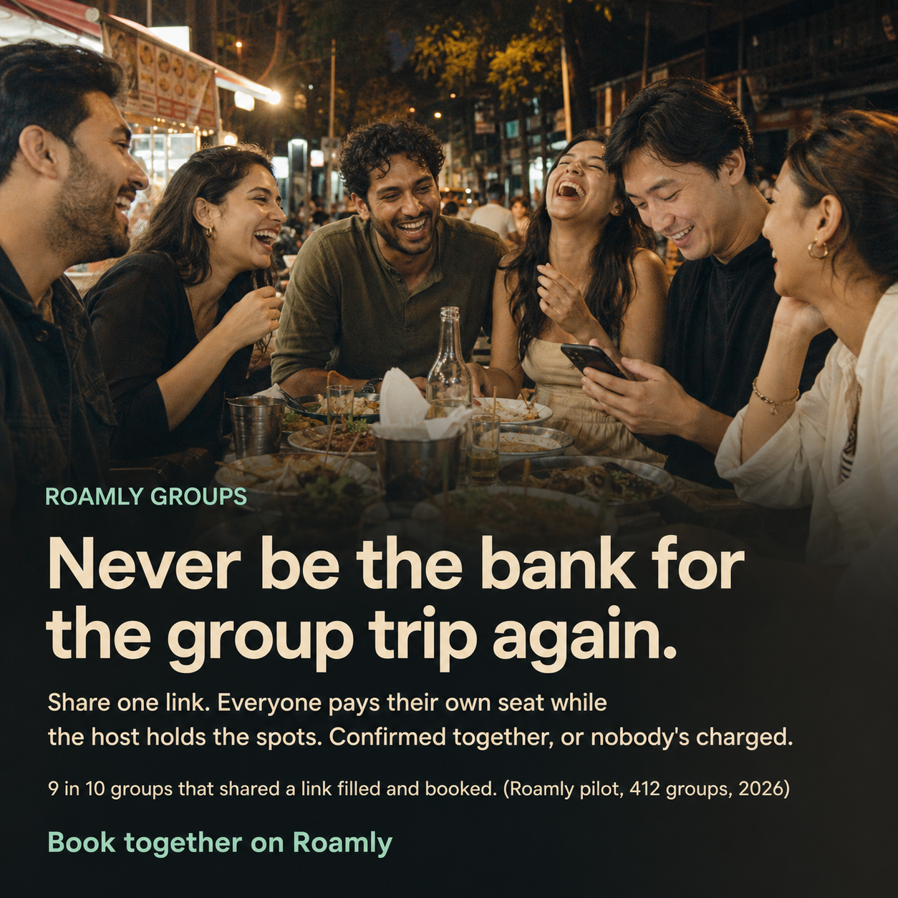

# Messaging Pillars & AI-Generated Asset: Roamly Groups

> Module 4 · Deliver Messaging That Captivates Customers · Deliverable 4
>
> The market shift behind Roamly Groups, two messaging pillars built from the Module 3 positioning, copy for the three surfaces that matter most in a product-led motion, and one AI-generated asset that went through two cold reads and two rewrites.

## 1. Fro/To market shift

| | |
|---|---|
| **From** (life before) | Booking anything for a group of friends means one person becomes the bank. They pick the experience, put the whole thing on their card before anyone has said yes, and spend the next two weeks reminding people to pay them back. Or nobody wants to be that person, the chat goes quiet, the slot sells out, and the group never books. |
| **To** (life after) | Booking for the group is the same as booking for yourself. One person shares a link, everyone pays for their own seat, the host holds the seats, and the booking confirms for all of them at once. Nobody fronts the money, nobody chases anyone, and "we should do this" turns into a confirmed Saturday. |

The shift rarely appears in copy word for word. It sets the frame: the organizer's problem is not finding something to do, it is getting the group to commit without carrying the risk.

## 2. Audience segmentation

- **Number of audiences that need their own pillar:** 2
- **Justification:** Split by role in the transaction. The organizer has the pain: they front the money and chase friends, and they are the existing Roamly user we reach in product. The friends have no pain today (Venmo works for them) and are mostly not on Roamly, yet each one has to open a link and pay before the booking exists, so they are the majority of the conversions. A message built for the organizer ("never be the bank") means nothing to a friend who was never the bank. A message built for the friend ("one tap and your seat is yours") does not touch the organizer's problem. One message would miss one of them. The host is the third party in every booking, but hosts are reached through supply-side enablement rather than customer messaging, so they get a sales one-liner in activation rather than a pillar.

## 3. Messaging pillars

### Pillar, Audience 1: the organizer

The friend who plans the group trip, has booked on Roamly before, and ends up fronting the money and chasing everyone to pay them back.

| Layer | Message |
|---|---|
| **🎯 Value prop**: the promise you lead with | Never be the bank for the group trip again. Pick the experience, share one link, and the whole group books together without the whole trip on your card. |
| **🏆 Capabilities**: the features that make the value prop real | One shareable link per experience. Each friend pays for their own seat from the link. The host holds the seats until the group is full or the deadline passes. The booking confirms for everyone at once, and if the group does not fill, nobody is charged. Reminders come from Roamly, not from you. |
| **📊 Evidence**: specific proof | In Airbnb's 2017 survey of 2,000 travelers, 38% of people who traveled in a group had not been paid back in full, and 43% of those had lost $1,000 or more. Roamly's own support queue shows organizers working around the product today: separate accounts on the same slot, manual split payments, and high drop-off on those sessions. Supply: 12,000 vetted local experts across 40 cities. Outcome proof, illustrative until the first launch city reports: 9 in 10 groups that shared a link filled and booked (Roamly pilot, 412 groups, 2026). This is the group completion rate from Module 1, stated as a pilot result; the other real figure to add is average seats per booking. |

### Pillar, Audience 2: the friend

Someone invited by the organizer, usually not on Roamly, who needs to say yes and pay for their seat without installing anything or creating an account.

| Layer | Message |
|---|---|
| **🎯 Value prop** | One tap and your seat is yours. Pay your share from the link and you are in. Nobody is chasing you, and you are never charged unless the whole group is going. |
| **🏆 Capabilities** | Guest checkout on one screen, with Apple Pay and Google Pay. No app to install and no account before you pay; an account is offered after. Your seat is held while the rest of the group pays. If the group does not fill by the deadline, you are not charged. |
| **📊 Evidence** | The experience itself: the host's rating, review count and vetting badge on the payment screen, so the friend is paying a real person for a real slot. The countdown and the list of who has already paid. Proof to add from the pilot: taps from link to paid, and the share of invited friends who complete. |

Where the words come from: "the bank," "chasing," and "fronting the money" are how organizers describe the job in the split-payment support tickets and the "book for my friends" feedback from Module 1; "one tap" and "no account" are the friend's two objections from the Module 2 battlecard. The pillars borrow that language rather than inventing it.

One correction I made during activation: the organizer value prop first read "without a dollar on your card." The organizer still pays for their own seat, so I changed it to "without the whole trip on your card."

## 4. Activation across surfaces

The motion is product-led, so the in-product surfaces carry the weight. I chose one surface per party in the booking, and the one I was least sure of, the friend's screen, is the one most worth testing.

| Surface | Copy variation |
|---|---|
| In-app notification, shown to the organizer at checkout when they are about to book one seat | **Booking for a group? Don't put it on your card.** Share one link instead. Each friend pays for their own seat, and the host holds the seats until the group is full. If it doesn't fill by the deadline, nobody is charged. Roamly sends the reminders, not you. Buttons: *Share a group link* / *Just book my seat*. Leads with the pain half of the value prop, because the organizer is one tap from the old pattern. Evidence is left out on purpose: this organizer has lived the problem, and a statistic at checkout reads as marketing. |
| Onboarding tooltip, the first thing a friend sees on the payment screen after opening the link | **[Maya] saved you a seat.** Pay your share here, no account needed. You're only charged once the whole group is in. If it doesn't fill by [Friday], you pay nothing. Leads with the organizer's name, the only thing on the screen the friend already trusts, then answers the two reasons to bounce: "do I have to sign up" and "what am I committing to." The trust evidence (host rating, countdown, who has paid) is on the screen itself, so the tooltip does not repeat it. |
| Sales one-liner, what the supply team opens with when asking a host to hold seats for groups | We'd like to send you full groups that have already paid. All we ask is that you hold the seats until the group's deadline, and if it doesn't fill by then, every seat comes straight back to you, so you never hold a seat for someone who won't show. Outcome first, the honest ask second, the safety valve last. Roamly's scale is not the proof here; the host is already one of the 12,000. |

I checked each variation against its pillar. None needed a rewrite; the only change was the value-prop correction above.

How I will know the messaging is working, one signal per surface: the share of organizers who tap *Share a group link* instead of *Just book my seat* at checkout (conversion by surface); the share of invited friends who pay from the tooltip screen (in-product engagement, and the same number as the Module 1 completion metric); the share of hosts who opt into the hold after the one-liner (win/loss theme on the supply side). And one drift check across all three: whether organizers describe the feature as "not being the bank" in reviews and tickets, or in some other words. If their words stop matching ours, the message has not reached them.

## 5. AI-generated asset

- **Asset type:** One-card social post (1:1) for the organizer, generated with an AI image model from a photo brief and the exact copy. It is the third version. The first was a text-heavy card with all three capability rows and two stat blocks, which read as an infographic. The second put the message over a candid photo and read as a moment, but the compressed subline had dropped the hold. The third restores the hold and swaps the competitor's survey for Roamly's own proof point. Two cold reads then tested the proof line itself, and the final version carries a completion rate with a sample size.
- **Prompt used:**

  > Create a 1080x1080 social post for Roamly Groups, a feature of a travel experiences app. Photo: a candid phone-shot moment, six friends in their late twenties around a street-food table at night, mid-laugh. One of them, the organizer, is looking at their phone with quiet relief. Warm light, real skin, slightly grainy. Not staged, not stock. Text overlay, exactly these lines in this order, nothing added: 1. Small label, top of the text block: ROAMLY GROUPS. 2. Headline, large, two lines: Never be the bank for the group trip again. 3. Two lines below it: Share one link. Everyone pays their own seat while the host holds the spots. Confirmed together, or nobody's charged. 4. Small line: 9 in 10 groups that shared a link filled and booked. (Roamly pilot, 412 groups, 2026). 5. Button, bottom left: Book together on Roamly. Layout: text block in the lower 45% on a soft dark gradient so the faces stay clear. Cream sans-serif text, mint for the label and button. No icons, no boxes, no bullets, no charts. It should read like a shared moment with the message as its caption.

- **Output:**

- **What you edited and why:** Three rounds. After the first cold read of the infographic version (kept as `assets/roamly-m4-asset-v0.png`), I cut the unsourced "3x the industry average" line and moved the brand label to the top; the reader had said an unsourced claim next to a cited one lowered trust, and that the company name only appeared at the bottom. Then I dropped the infographic layout altogether: three capability rows and two stat blocks made it read as a chart, not a message, which the class's "be human" filter argues against. The photo version compressed the three capabilities into one subline and lost the hold, which is the core product truth from Module 3, so I put it back: "while the host holds the spots." Then I replaced the Airbnb survey with a Roamly proof point. A competitor's statistic on Roamly's own ad is odd, and the class asks for named, specific evidence. The proof line took three tries. "9 in 10 groups confirm within 48 hours" failed a cold read: it measured speed, and the headline is about money. "9 in 10 groups booked with nobody fronting the money" matched the headline but contradicted the product: with the all-or-nothing rule nobody can front the money, so a rate implies a hole that does not exist, and the line only restated the promise. The final line, "9 in 10 groups that shared a link filled and booked," proves the thing the promise depends on and a skeptic doubts, that the group actually books, and it is the same completion metric Modules 1 and 2 set as the leading indicator. The scenario has no launch data, so the pilot figure is illustrative and is labeled that way in the pillar. The "no account needed" and "Roamly sends the reminders" capabilities stay off the social post on purpose; they belong on the friend's screen and the checkout notification.

## 6. Blind-read result

Cold read of the shipped asset, no context.

| Question | What they understood |
|---|---|
| Who is it built for? | "The one friend in a group of five to eight who always ends up planning the trip, booking the thing on their own card, and then spending weeks chasing everyone on a group chat for their share." Young adult, urban, travels with friends rather than family, "has been burned before by someone dropping out after the deposit was paid." The photo said friend group abroad, not couples, families or a corporate offsite. |
| What does the product do? | "A split-pay group booking flow with a hold and an all-or-nothing trigger": one link, each person pays their own place, the reservation is held meanwhile, and the booking confirms for the whole group or nobody is charged. Guessed at: what is being booked ("seat" nudges toward flights or a tour, the photo is a dinner), and whether Roamly is a marketplace or a payment layer on someone else's inventory. |
| What makes you trust it? | The one proof point "is a specific number with a sample size, a date, and a source label. That is more than most ads offer, and 412 is big enough to not sound like a friends-and-family test." The all-or-nothing rule "is also a trust mechanism in itself: it removes the exact fear the headline names." Net: "the mechanism convinced me more than the number did." The reader wanted a stat about money not fronted instead of a fill rate, and called "groups that shared a link" a filtered denominator. |

What the reads settled, and what they did not. The proof line took three versions and four cold reads. A speed statistic proved a different claim than the headline. A money statistic ("9 in 10 groups booked with nobody fronting the money") matched the headline, but a reader asked whether the other one in ten had fronted the money anyway, which exposed that under the all-or-nothing rule nobody can, so the line was a rate on something that cannot vary and only restated the promise. The shipped line is the completion rate, the same leading indicator Modules 1 and 2 set, because the thing the promise depends on and a skeptic doubts is whether the group books at all. The final reader still asked for a money stat; the answer is that the mechanism is the proof of the money promise, and the number proves the mechanism works. Two flags I left open for the landing page rather than another regeneration: drop "that shared a link" so the denominator is every group started, and name the unit of purchase once, since "seat," "spots" and "trip" pull in different directions and the photo shows a dinner.

## Link to full artifact

- [Messaging Builder export: shift, audiences, pillars, activation, blind read](roamly-m4-messaging-builder.md)
- [Exercise 2: copy generation prompt and verbatim response; blind read of the asset, verbatim](roamly-m4-messaging-ex2.md)
