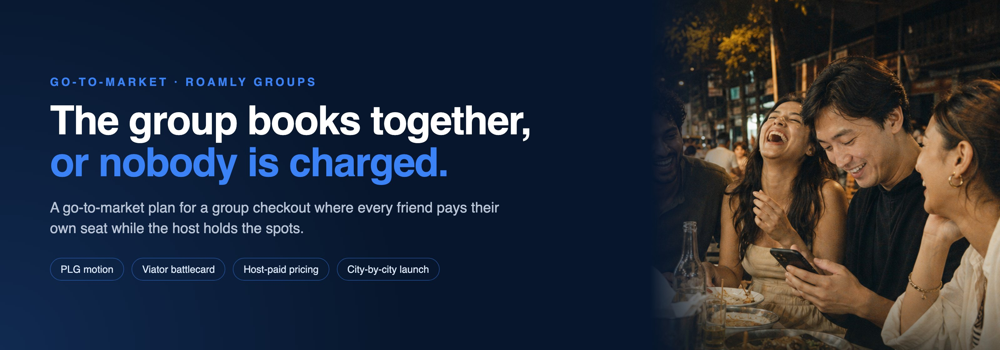

[](https://antje.github.io/product-school-go-to-market/06-launch/final-presentation.html)

# Roamly Groups: the hold is the product

One friend books the food tour for six, puts it on their own card before anyone has said yes, and spends the next two weeks chasing the others on Venmo. Or nobody wants that job, the group chat goes quiet, and the booking never happens. Roamly's support queue is full of these sessions. The demand is already there, and Roamly loses it.

**[Open the final presentation](https://antje.github.io/product-school-go-to-market/06-launch/final-presentation.html)** · [Read the pricing memo](05-pricing/roamly-m5-pricing-memo.md) · [See the Viator battlecard](02-competitive-intel/roamly-m2-battlecard.md)

My final project for Product School's Go-to-Market certification, by Antje Barth, September 2026 weekend cohort. Roamly is a fictional teaching scenario: nothing about it is a fact about a real company.

## The strategy in one sentence

Roamly Groups is a group checkout where every friend pays their own seat while the host holds the spots, so the group books together or nobody is charged. It wins the moment a group has chosen an experience, launches product-led through organizers who already use Roamly, and is paid for by hosts, never by travelers.

## Why the host, not the checkout

Viator holds seats with no money down but still charges one card. Cash App Pools collect money from everyone but cannot hold a seat. Airbnb built group split payments in 2017 and retired them in 2018, because its hosts disliked holding dates for groups that had not paid. Confirming a whole group at once only works if the host agrees to hold the seats. So the product is a supply policy, and the checkout is how travelers see it.

Airbnb could rebuild the mechanic within a year. What it cannot copy in twelve months is what Roamly accumulates from the first launch city: which hosts honor holds, which slots fill as groups, organizers who rebook groups, and the friends each group brings onto Roamly. That lead holds only if Roamly moves first.

## What I would do

1. **Win the hosts first.** A city launches only when 60% of its vetted hosts agree to hold seats for groups. The hold is 48 hours from the first invite, closing 72 hours before the experience, a hypothesis the pilot tests.
2. **Release before launching.** One quarter of real group bookings in the first city, with no campaign. Later cities release for four to six weeks each, several at a time.
3. **Launch product-led.** A "booking for a group?" prompt at checkout, an email to organizers who asked for this in support tickets, and the invite link as the channel to the friends. Paid channels only after group completion holds for a quarter.
4. **Charge the host, never the traveler.** Group-ready at the standard commission, Group Plus at +4 points on group bookings, Private Groups at +6. Travelers see no fee and no tier.
5. **Pull back on numbers set in advance.** Pause a city if host retention falls below 60% or hosts release more than 5% of holds early. Stop at once if any traveler is charged for a group that did not fill.

Not competing on discovery or breadth, not charging travelers, not launching itinerary planning or company teams as the headline, and not launching in a city where hosts will not hold.

## The brief, answered

- **The most valuable segment:** friend groups of 3 to 8, reached through the organizer: a repeat Roamly user who fronts the money today. Their demand is already in the support queue. Company teams come later; they need invoicing and a sales-led motion.
- **Is the product ready?** The checkout is. The supply side is not proven, so readiness is decided city by city: 60% host opt-in to launch, and a quarter of hosts still holding seats to scale.
- **Without disrupting what already works:** individual bookings, traveler prices and existing host commissions do not change. Hosts opt in; organizers see Groups as a separate entry point at checkout.
- **A path into a market Roamly has never served:** group booking is the new market, and the way in is the audience Roamly already has. Every group sends a payment link to up to seven people who are mostly not on Roamly, so each completed group brings new customers.

## The numbers, and where they come from

The scenario gives no data. Every figure below is sourced, derived from the structure, or named as an assumption.

| Number | What it is | Where it comes from |
|---|---|---|
| **60%** host opt-in per city | The launch gate | At 60% opt-in, a group comparing three options has at least one group-bookable choice 1 − 0.4³ = 94% of the time; at 40%, 78% |
| **70% vs 21%** | A group of seven completes at 95% vs 80% per-friend completion | 0.95⁷ and 0.8⁷. The strategy depends on which is closer to the truth |
| **4 seats** per group booking | The north star, read against a holdout | Groups of 3 to 8 have a midpoint of 5.5; 4 leaves room for the last friend dropping out |
| **$60 / $72 / $78** to Roamly per group | Group-ready / Group Plus / Private Groups | Five seats × $60 × 20%, 24%, 26%. Today that session earns $0 |
| **1 extra seat every 3.8 groups** | Group Plus break-even for the host | The $12 uplift ÷ $45.60 net per extra seat |
| **48 hours** | The group hold | A pilot hypothesis: shorter than the 72 hours Airbnb's hosts rejected |

- **Sourced:** Airbnb's Split Payments (2017 to 2018, and its survey finding that 38% of group travelers were not paid back in full), Viator's Reserve Now & Pay Later and commission, Cash App Pools. Cited in [Module 2](02-competitive-intel/battlecard-and-bet.md).
- **Assumed, to replace with data:** Roamly's commission (20%, parity with Viator's base), the average seat price ($60), the average group size (five), and the current drop-off rate on group sessions.
- **Illustrative:** the pilot line on the social post ("9 in 10 groups that shared a link filled and booked, 412 groups") shows the pilot's target, not a measured result.

## The decision this asks for

Approve a one-quarter pilot in one launch city, gated on 60% of its vetted hosts opting in, with the tripwires above. It changes no existing price and no solo booking. What it returns: the four assumptions above replaced with data, and the first hold record, which is the part of the lead a larger competitor cannot copy.

## Deliverables at a glance

| Module | Framework | The decision | The work |
|---|---|---|---|
| 1 · GTM strategy | Discover Framework, five motion inputs | Friend groups through the organizer; product-led; expand | [gtm-strategy.md](01-gtm-strategy/gtm-strategy.md) · [infographic](01-gtm-strategy/roamly-m1-gtm-infographic.png) |
| 2 · Competitive intel | Competitor tiers, battlecard, Data → Insight → Belief → Bet | Viator is the rival; own the commitment moment; win the hosts first | [battlecard-and-bet.md](02-competitive-intel/battlecard-and-bet.md) · [battlecard](02-competitive-intel/roamly-m2-battlecard.md) |
| 3 · Positioning | Six-component framework, category reframe, pressure tests | "Share one link, everyone pays their own seat, and the group books together or nobody is charged" | [positioning.md](03-positioning/positioning.md) |
| 4 · Messaging | Fro/To shift, pillars per audience | Organizer: never be the bank. Friend: one tap and your seat is yours | [messaging-and-asset.md](04-messaging/messaging-and-asset.md) · [asset](04-messaging/assets/roamly-m4-asset.png) |
| 5 · Pricing | Value-based, Good-Better-Best, Van Westendorp | Host pays through commission in three tiers; travelers never pay | [pricing-recommendation.md](05-pricing/pricing-recommendation.md) · [memo](05-pricing/roamly-m5-pricing-memo.md) |
| 6 · Launch | Launch vs release, enablement order, owned/paid/earned | City by city, host side enabled first, tripwires set in advance | [individual-insights.md](06-launch/individual-insights.md) · [presentation](06-launch/final-presentation.html) |

## Where it goes next

Once hosts hold and groups complete, group booking becomes the default way to book any party of three or more on Roamly. Group Plus and Private Groups turn that into host-paid revenue. Company teams become the second segment, with invoicing and a sales-led motion. And every friend who paid for a seat is a new Roamly customer who has already had a good experience.

## Repo structure

```
product-school-go-to-market/
├── README.md
├── assets/header.jpg
├── 01-gtm-strategy/        gtm-strategy.md, infographic, exercise records, builder export
├── 02-competitive-intel/   battlecard-and-bet.md, Viator battlecard, exercise records, builder export
├── 03-positioning/         positioning.md, exercise record, builder export
├── 04-messaging/           messaging-and-asset.md, the social asset, exercise record, builder export
├── 05-pricing/             pricing-recommendation.md, stakeholder memo, exercise records
└── 06-launch/              individual-insights.md, final-presentation.html, final-presentation.md, exercise records
```
